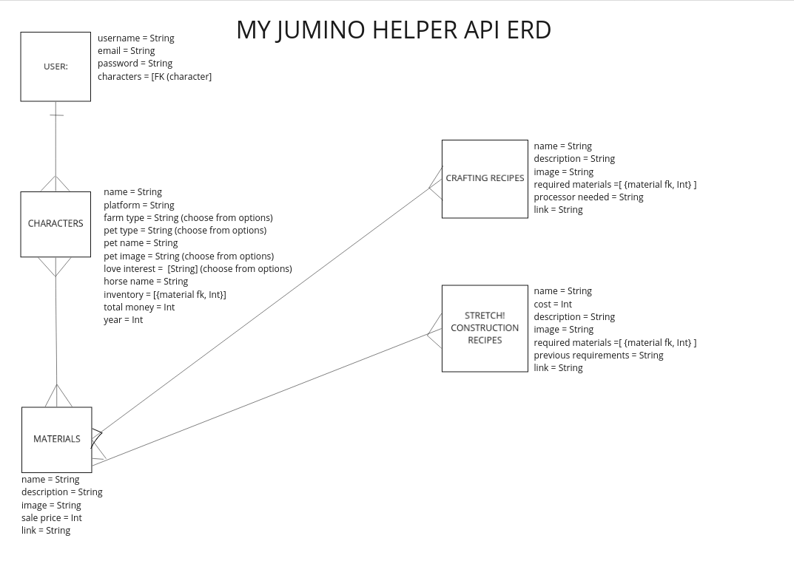

# my-junimo-api

# Summary: 
Finally, an app that makes resource and crafting management easy in Stardew Valley! This app allows you to manage the inventory of your character(s) and easily see if your inventory meets the requirements for crafting items (and larger projects!) inside Stardew Valley.

# Technologies Used
Django/SQL Backend (Python)
React Frontend

# Link to Client Side
https://github.com/alysvolatile/my-Junimo-Client

# Team:
Nick Esparza, Alys Cooper

# External API/Seed Data Used
* Twitter API (<a href='https://developer.twitter.com/en/products/twitter-api'>here</a>) to link to recent tweets from Stardew Valley developer ConcernedApe.
* Seed Data taken from the <a href='https://stardewvalleywiki.com/'>Stardew Valley Wiki</a>.

# ERDs

# Whiteboarding of SQL relationships

# MVP MODELS (listed in ERD as well)
* User (for player) - name
* Characters Table - (one to many from user to characters; 'saves') (fully crudable) 
    - Name (string)
    - Platform (string)
    - Farm Type (string)
    - Pet Type (string)
    - Pet Name (string)
    - Pet image (if cat, choose cat images; if dog, choose dog images - are there pigs too?) (string)
    - Love Interest/Spouse (string)
    - Horse Name (string)
    - Total G
    - Year 
* Materials Table
    - material name
    - description
    - image
    - sale price
    - link to wiki page
* Inventory Table
    - ref Character id
    - ref Material id
    - Amount 
* Crafting Recipes Table
    - name
    - description
    - processor needed (eg. forge, kiln)
* Blueprint Materials Table
    - ref Crafting Recipe id
    - ref Material id
    - Amount needed

* STRETCH GOAL - Construction projects from Robin 
    - name
    - cost
    - required material array
    - previous requirements (big coop requires coop)

### USER route table

| Verb   | URI Pattern            | Controller#Action |
|--------|------------------------|-------------------|
| POST   | `/sign-in`             | `users#signin`    |
| PATCH  | `/change-password/`    | `users#changepw`  |
| DELETE | `/sign-out/`           | `users#signout`   |

### CHARACTER route table

| Verb   | URI Pattern            | Controller#Action |
|--------|------------------------|-------------------|
| GET    | `/view-all-characters` | `characters#view-all`   |
| GET    | `/view-character`        | `characters#view`   |
| POST   | `/create-character`      | `characters#create`    |
| PATCH  | `/edit-character/`       | `characters#edit`  |
| DELETE | `/delete-character/`     | `characters#delete`   |

### MATERIAL route table

| Verb   | URI Pattern            | Controller#Action |
|--------|------------------------|-------------------|
| GET    | `/view-material`        | `materials#view`   |
| GET    | `/view-all-materials`        | `materials#view-all`   |

### CRAFTING RECIPE route table

| Verb   | URI Pattern            | Controller#Action |
|--------|------------------------|-------------------|
| GET    | `/view-crafting-recipes`        | `crafting-recipes#view`   |
| GET    | `/view-all-crafting-recipes`        | `crafting-recipes#view-all`   |

### STRETCH GOAL - CONSTRUCTION BLUEPRINT route table

| Verb   | URI Pattern            | Controller#Action |
|--------|------------------------|-------------------|
| GET    | `/view-blueprint`        | `blueprints#view`   |
| GET    | `/view-all-blueprints`        | `blueprints#view-all`   |
